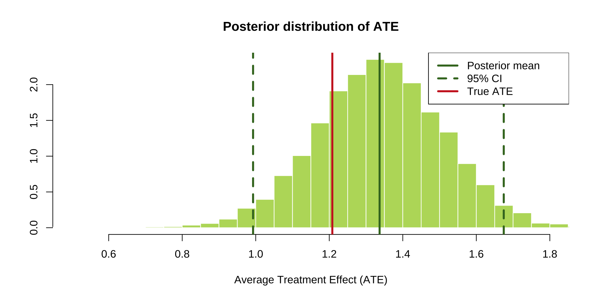

# ShrinkageTrees = 4.2">   [](https://cran.r-project.org/package=ShrinkageTrees)
 

## Overview

**ShrinkageTrees** provides a unified framework for survival analysis using Bayesian regression tree ensembles, with a particular focus on **causal inference and high-dimensional data**.

The package implements Horseshoe Trees, Causal Horseshoe Forests, and their more general counterparts — Shrinkage Trees and Causal Shrinkage Forests — alongside well-known Bayesian tree models such as BART, DART, and BCF. All models are adapted to right-censored data via accelerated failure time (AFT) formulations.

Its central methodological innovation is the **Horseshoe regularisation mechanism applied directly to tree step heights**, enabling adaptive global–local shrinkage in high-dimensional settings. In addition to classical BART priors, the package supports:

- Horseshoe priors  
- Forest-wide Horseshoe shrinkage  
- Empirical Bayes Horseshoe calibration  
- Half-Cauchy priors  
- Dirichlet splitting priors (DART)  

These models enable flexible non-linear modelling for:

1) High-dimensional prediction  
2) High-dimensional causal inference  
3) Estimation of heterogeneous (conditional average) treatment effects (CATE)  

Supported outcome types:

- Continuous outcomes  
- Binary outcomes  
- **Right-censored survival times (AFT framework)**  

All models are implemented with an efficient C++ backend via Rcpp, allowing scalable MCMC sampling in high-dimensional settings.


## ⭐ Core Contribution: Horseshoe Trees

Traditional BART and DART primarily regularise model complexity through the **tree structure (e.g., depth constraints or splitting probabilities).

ShrinkageTrees instead introduces global–local shrinkage directly on the leaf (step height) parameters via the Horseshoe prior.

A global parameter controls overall shrinkage, while local parameters allow strong signals to escape shrinkage. Small effects are aggressively shrunk toward zero, whereas large effects are preserved due to the heavy-tailed prior.

This strategy retains all covariates, reduces noise in high-dimensional settings, and improves robustness in causal models.

This methodology is introduced in:

> *Horseshoe Forests for High-Dimensional Causal Survival Analysis*  
> T. Jacobs, W.N. van Wieringen, S.L. van der Pas  
> https://arxiv.org/abs/2507.22004


## 🧠 Implemented Models

ShrinkageTrees implements a modular family of Bayesian tree models:

### Single-Forest Models

- **HorseTrees** — BART with Horseshoe shrinkage on leaf parameters  
- **DART** — Dirichlet prior on splitting probabilities  
- **Standard BART** — Classical Gaussian leaf prior  

### Causal Models (BCF-style decomposition)

- **CausalHorseForest** — Prognostic + treatment forests with Horseshoe shrinkage  
- **CausalShrinkageForest** — General shrinkage framework  
- **BCF** — Bayesian Causal Forest for right-censored AFT models  
- **Shrinkage BCF** — Combined structural and magnitude shrinkage  

All causal models support right-censored survival data and heterogeneous treatment effect (CATE) estimation.

## 🌲 Tree Regularisation Strategies

ShrinkageTrees supports multiple regularisation mechanisms:

- **Standard BART prior**  
  Structural regularisation through tree depth and splitting probabilities.

- **Dirichlet splitting prior (DART)**  
  Structural sparsity induced via a Dirichlet prior on splitting proportions.

- **Horseshoe shrinkage on step heights**  
  Global–local shrinkage applied directly to leaf parameters.

- **Alternative shrinkage priors on step heights**  
  Including global Cauchy and forest-wide shrinkage formulations for flexible control of overall regularisation strength.


## 📦 Installation

The released version of ShrinkageTrees can be installed from [CRAN](https://cran.r-project.org/package=ShrinkageTrees):

```r
install.packages("ShrinkageTrees")
```

You can install the development version from [GitHub](https://github.com/tijn-jacobs/ShrinkageTrees):

```r
# Install devtools if not already installed
install.packages("devtools")
devtools::install_github("tijn-jacobs/ShrinkageTrees")
```


## 🚀 Example

```r
library(ShrinkageTrees)

set.seed(42)
n <- 100
p <- 1000

# Generate covariates
X <- matrix(runif(n * p), ncol = p)
X_treat <- X_control <- X
treatment <- rbinom(n, 1, X[, 1])
tau <- 1 + X[, 2]/2 - X[, 3]/3 + X[, 4]/4

# Generate survival times (on log-scale)
true_time <- X[, 1] + treatment * tau + rnorm(n)
censor_time <- log(rexp(n, rate = 0.05))
follow_up <- pmin(true_time, censor_time)
status <- as.integer(true_time <= censor_time)

# Fit a standard Causal Horseshoe Forest (without propensity score adjustment)
fit_horseshoe <- CausalHorseForest(
  y = follow_up,
  status = status,
  X_train_control = X_control,
  X_train_treat = X_treat,
  treatment_indicator_train = treatment,
  outcome_type = "right-censored",
  timescale = "log",
  number_of_trees = 200,
  k = 0.1,
  N_post = 5000,
  N_burn = 5000,
  store_posterior_sample = TRUE
)

# Posterior mean CATEs
CATE_horseshoe <- colMeans(fit_horseshoe$train_predictions_sample_treat)

# Posteriors of the ATE
post_ATE_horseshoe <- rowMeans(fit_horseshoe$train_predictions_sample_treat)

# Posterior mean ATE
ATE_horseshoe <- mean(post_ATE_horseshoe)

# Plot the posterior of the ATE
```


## 🩺 Pancreatic Cancer Analysis Demo

The package includes a **demo analysis** based on the TCGA PAAD (pancreatic cancer) dataset to showcase how ShrinkageTrees can be used in practice. This demo replicates the main case study from the preprint *"Horseshoe Forests for High-Dimensional Causal Survival Analysis"* ([arXiv:2507.22004](https://arxiv.org/abs/2507.22004)).

The demo:
- Estimates propensity scores for treatment assignment  
- Fits a Causal Horseshoe Forest to the survival times with right-censoring  
- Computes the posterior mean ATE and individual CATEs with 95% credible intervals  
- Produces diagnostic plots (propensity score overlap, posterior ATE, CATE estimates, sigma trace)


You can run it directly from R after installing the package:
```r
demo("pdac_analysis", package = "ShrinkageTrees")
```

## 🔬 Why ShrinkageTrees Is Unique

ShrinkageTrees provides:

- Bayesian Causal Forests for right-censored survival data  
- Dirichlet splitting priors for structural sparsity  
- Horseshoe shrinkage applied directly to tree step heights  
- A unified AFT-based framework for heterogeneous treatment effects  

To our knowledge, no other R package combines:

- BCF  
- DART  
- Horseshoe leaf shrinkage  
- Survival data support  

within a single coherent Bayesian tree framework.

## 📄 Documentation

- In R: `?ShrinkageTrees`, `?HorseTrees`, `?CausalHorseForest`, and `?CausalShrinkageForest` for detailed help of the Horseshoe Forests.
- For survival-specific Bayesian tree functions, see: `?SurvivalBART`, `?SurvivalDART`, `?SurvivalBCF`, and `?SurvivalShrinkageBCF`.
- Examples and parameter descriptions can be found in each function’s documentation.


## 🤝 Contributing

Contributions are welcome! Feel free to open an [issue](https://github.com/tijn-jacobs/ShrinkageTrees/issues) or submit a pull request. 
The software is designed to be flexible and modular, allowing for a wide variety of global-local shrinkage priors to be easily implemented and extended in future versions.


## 📜 License

This package is licensed under the [MIT License](https://cran.r-project.org/web/licenses/MIT).


## 🇪🇺 Acknowledgments

This project has received funding from the European Research Council (ERC) under the European Union’s Horizon Europe program under Grant agreement No. 101074082. Views and opinions expressed are however those of the author(s) only and do not necessarily reflect those of the European Union or the European Research Council Executive Agency. Neither the European Union nor the granting authority can be held responsible for them

